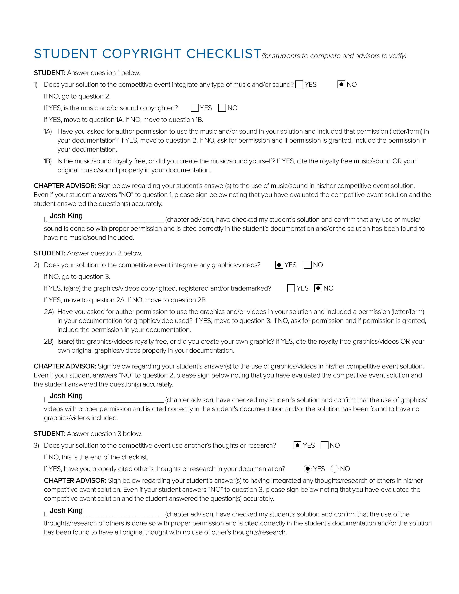

<html lang="en">
<head>
<title>MedComms</title>
<meta charset="utf-8">
<meta name="viewport" content="width=device-width, initial-scale=1">

</head>
<body>

  <a class="active" href="https://cadisharkboy.github.io/MedComms/">Home</a>
  <a href="https://cadisharkboy.github.io/MedComms/services.html">Services</a>
  <a href="https://cadisharkboy.github.io/MedComms/prices.html">Pricing</a>
  <a href="https://cadisharkboy.github.io/MedComms/about.html">About Us</a>
  <a href="https://cadisharkboy.github.io/MedComms/work-cited.html">Work Cited</a>

 

  

   <h3> Research </h3>
   
Med Comms was inspired by research based on the following websites:

   
<a target="_blank" href="https://ivycreekhealth.com/"> Ivy Creek Health </a>

   
<a target="_blank" href="https://prooncall.com/telecommunications-in-healthcare-amidst-a-pandemic/"> ProOnCall </a>

   
<a target="_blank" href="https://www.nutrimedy.com/"> Nutrimedy </a>

   
<a target="_blank" href="https://www.hale.co/"> Hale </a>

  

  

   <h3> Images </h3>
   
All graphics were created by Marion Coffman.

   
Image of doctor helping his patient is from:
   <a target="_blank" href="https://www.freepik.com/photos/people"> Freepik </a>

  

    
    
Click Here for the Student Copyright Checklist

  

  

  

    
    
Click Here for the Work Log: Part One

  

  

    
    
Click Here for the Work Log: Part Two

  

  

    
    
Click Here for the Work Log: Part Three

  

